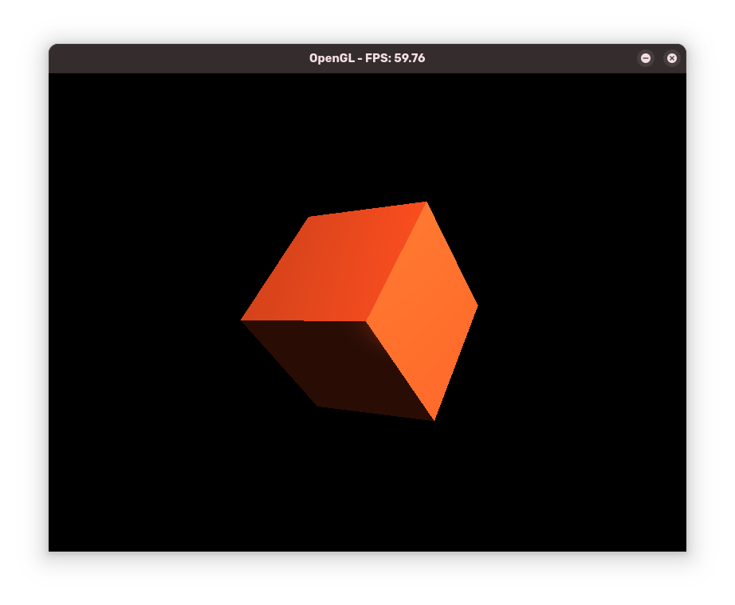

# 3D Engine in C

## Description

This project have for objective to learn `OpenGL` library with `C` language.



## Installation

To compile this project, you need `SDL2` and `OpenGL` installed on your computer.

Then, you can compile the project by following the steps below:

```bash
# After clonning the project
cd 3d
make
```

This will create a `3d` executable in the `bin` folder.

## Usage

To run the project, use the following commands:

```bash
cd ../bin
chmod +x 3d
./3d
```

### Keybinds

| Key | Action |
| --- | ---    |
| `l` | Toggle the light |
| `r` | Toggle auto rotate |
| `left` | Rotate the cube on the left |
| `right` | Rotate the cube on the right |
| `up` | Rotate the cube on the up |
| `down` | Rotate the cube on the down |
| `esc` | Exit |

## Cleanup

You can clean the objects files and the executable by running the command:

```bash
cd ..
make clean
```

## Contributing

If you find a bug or have a suggestion to improve the project, feel free to open an issue or fork the project.

## License

This project is licensed under the MIT License - see the [LICENSE](LICENSE) file for details.

## Author

- **[Hokanosekai](https://github.com/Hokanosekai)** - _Initial work_
